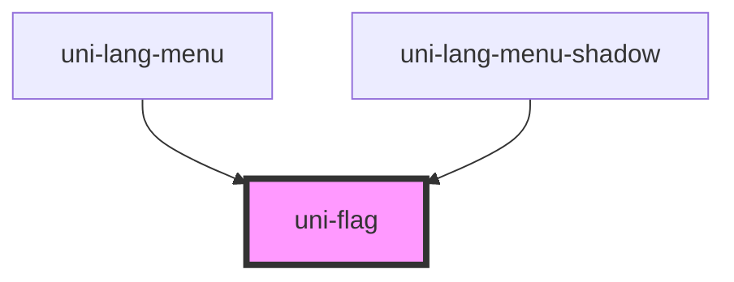

# uni-flag

<!-- Auto Generated Below -->

## Properties

| Property  | Attribute | Description | Type                           | Default     |
| --------- | --------- | ----------- | ------------------------------ | ----------- |
| `alt`     | `alt`     |             | `string`                       | `'flag'`    |
| `name`    | `name`    |             | `"cn" \| "en" \| "ru" \| "us"` | `undefined` |
| `rounded` | `rounded` |             | `boolean`                      | `undefined` |
| `src`     | `src`     |             | `string`                       | `undefined` |

## Dependencies

### Used by

 - [uni-lang-menu](../../../lang-menu/components/@main)
 - [uni-lang-menu-shadow](../../../lang-menu/components/shadow)

### Graph

----------------------------------------------

*Built with [StencilJS](https://stenciljs.com/)*
