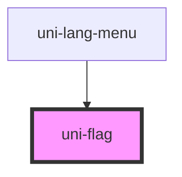

# uni-flag

<!-- Auto Generated Below -->

## Properties

| Property | Attribute | Description | Type      | Default     |
| -------- | --------- | ----------- | --------- | ----------- |
| `alt`    | `alt`     |             | `string`  | `'flag'`    |
| `square` | `square`  |             | `boolean` | `undefined` |
| `src`    | `src`     |             | `string`  | `undefined` |

## Dependencies

### Used by

 - [uni-lang-menu](../../../lang-menu/components/@main)

### Graph

----------------------------------------------

*Built with [StencilJS](https://stenciljs.com/)*
