# uni-lang-menu-shadow

<!-- Auto Generated Below -->

## Properties

| Property            | Attribute        | Description | Type                               | Default               |
| ------------------- | ---------------- | ----------- | ---------------------------------- | --------------------- |
| `activePath`        | `active-path`    |             | `string`                           | `'app.loc.active'`    |
| `feature`           | `feature`        |             | `string`                           | `'uni.store'`         |
| `list` _(required)_ | `list`           |             | `string`                           | `undefined`           |
| `mini`              | `mini`           |             | `boolean`                          | `false`               |
| `only`              | `only`           |             | `boolean`                          | `false`               |
| `round`             | `round`          |             | `boolean`                          | `false`               |
| `route`             | `route`          |             | `string`                           | `'lang'`              |
| `routing`           | `routing`        |             | `boolean`                          | `false`               |
| `select`            | `select`         |             | `string`                           | `undefined`           |
| `separator`         | `separator`      |             | `string`                           | `'.'`                 |
| `translatePath`     | `translate-path` |             | `string`                           | `'app.loc.translate'` |
| `type`              | `type`           |             | `"local" \| "memory" \| "session"` | `'memory'`            |

## Dependencies

### Depends on

- uni-store-set
- uni-menu-wrap
- uni-button
- uni-button-icon
- uni-event-store-get
- uni-flag
- uni-button-label
- uni-render
- uni-menu-surface
- uni-list-wrap
- uni-event-store-set
- uni-router-link
- uni-route
- uni-list-item
- uni-event
- uni-store-get
- uni-load-store

### Graph

```mermaid
graph TD;
  uni-lang-menu-shadow --> uni-store-set
  uni-lang-menu-shadow --> uni-menu-wrap
  uni-lang-menu-shadow --> uni-button
  uni-lang-menu-shadow --> uni-button-icon
  uni-lang-menu-shadow --> uni-event-store-get
  uni-lang-menu-shadow --> uni-flag
  uni-lang-menu-shadow --> uni-button-label
  uni-lang-menu-shadow --> uni-render
  uni-lang-menu-shadow --> uni-menu-surface
  uni-lang-menu-shadow --> uni-list-wrap
  uni-lang-menu-shadow --> uni-event-store-set
  uni-lang-menu-shadow --> uni-router-link
  uni-lang-menu-shadow --> uni-route
  uni-lang-menu-shadow --> uni-list-item
  uni-lang-menu-shadow --> uni-event
  uni-lang-menu-shadow --> uni-store-get
  uni-lang-menu-shadow --> uni-load-store
  uni-event-store-get --> uni-event
  uni-event-store-get --> uni-store-get
  uni-event-store-set --> uni-event
  uni-event-store-set --> uni-store-set
  uni-list-item --> uni-list-item-ripple
  uni-load-store --> uni-event
  uni-load-store --> uni-store-set
  uni-load-store --> uni-load
  style uni-lang-menu-shadow fill:#f9f,stroke:#333,stroke-width:4px
```

----------------------------------------------

*Powered by [UiWebKit](https://uiwebkit.com/)*
