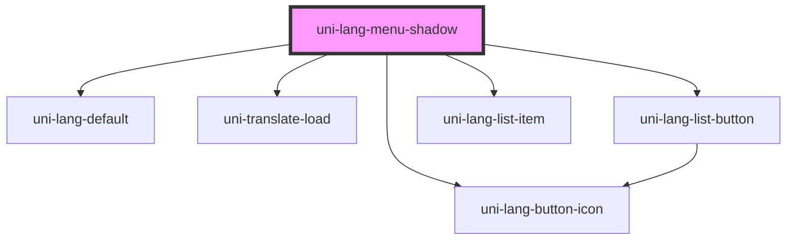

# uni-lang-menu-shadow

<!-- Auto Generated Below -->

## Properties

| Property        | Attribute        | Description | Type                               | Default           |
| --------------- | ---------------- | ----------- | ---------------------------------- | ----------------- |
| `activePath`    | `active-path`    |             | `string`                           | `'loc.active'`    |
| `feature`       | `feature`        |             | `string`                           | `'uni.store'`     |
| `frame`         | `frame`          |             | `boolean`                          | `false`           |
| `linear`        | `linear`         |             | `boolean`                          | `false`           |
| `mini`          | `mini`           |             | `boolean`                          | `false`           |
| `mode`          | `mode`           |             | `"flat" \| "outlined" \| "raised"` | `undefined`       |
| `round`         | `round`          |             | `boolean`                          | `false`           |
| `selectedIndex` | `selected-index` |             | `number`                           | `0`               |
| `separator`     | `separator`      |             | `string`                           | `'.'`             |
| `shadow`        | `shadow`         |             | `boolean`                          | `false`           |
| `top`           | `top`            |             | `boolean`                          | `false`           |
| `translatePath` | `translate-path` |             | `string`                           | `'loc.translate'` |
| `type`          | `type`           |             | `"local" \| "memory" \| "session"` | `'memory'`        |
| `value`         | `value`          |             | `UniLangItem[] \| string`          | `[]`              |

## Dependencies

### Depends on

- [uni-lang-default](../components/lang-default/@element)
- [uni-lang-button-icon](../components/lang-button-icon/@element)
- [uni-translate-load](../components/translate-load/@element)
- [uni-lang-list-button](../components/lang-list-button/@element)
- [uni-lang-list-item](../components/lang-list-item/@element)

### Graph

----------------------------------------------

*Powered by [UiWebKit](https://uiwebkit.com/)*
