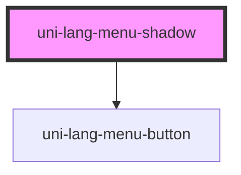

# uni-lang-menu-shadow

<!-- Auto Generated Below -->

## Properties

| Property            | Attribute        | Description | Type                               | Default           |
| ------------------- | ---------------- | ----------- | ---------------------------------- | ----------------- |
| `activePath`        | `active-path`    |             | `string`                           | `'loc.active'`    |
| `feature`           | `feature`        |             | `string`                           | `'uni.store'`     |
| `frame`             | `frame`          |             | `boolean`                          | `false`           |
| `languagesPath`     | `languages-path` |             | `string`                           | `'loc.languages'` |
| `linear`            | `linear`         |             | `boolean`                          | `false`           |
| `list` _(required)_ | `list`           |             | `string`                           | `undefined`       |
| `mini`              | `mini`           |             | `boolean`                          | `false`           |
| `mode`              | `mode`           |             | `"flat" \| "outlined" \| "raised"` | `undefined`       |
| `round`             | `round`          |             | `boolean`                          | `false`           |
| `route`             | `route`          |             | `string`                           | `'lang'`          |
| `routing`           | `routing`        |             | `boolean`                          | `false`           |
| `separator`         | `separator`      |             | `string`                           | `'.'`             |
| `shadow`            | `shadow`         |             | `boolean`                          | `false`           |
| `top`               | `top`            |             | `boolean`                          | `false`           |
| `translatePath`     | `translate-path` |             | `string`                           | `'loc.translate'` |
| `type`              | `type`           |             | `"local" \| "memory" \| "session"` | `'memory'`        |

## Dependencies

### Depends on

- [uni-lang-menu-button](../components/lang-menu-button/@element)

### Graph

----------------------------------------------

*Powered by [UiWebKit](https://uiwebkit.com/)*
