# uni-loc-menu

<!-- Auto Generated Below -->

## Properties

| Property        | Attribute        | Description | Type                               | Default               |
| --------------- | ---------------- | ----------- | ---------------------------------- | --------------------- |
| `activePath`    | `active-path`    |             | `string`                           | `'app.loc.active'`    |
| `feature`       | `feature`        |             | `string`                           | `'uni.store'`         |
| `list`          | `list`           |             | `string`                           | `undefined`           |
| `mini`          | `mini`           |             | `boolean`                          | `false`               |
| `round`         | `round`          |             | `boolean`                          | `false`               |
| `route`         | `route`          |             | `string`                           | `'lang'`              |
| `routing`       | `routing`        |             | `boolean`                          | `false`               |
| `select`        | `select`         |             | `string`                           | `undefined`           |
| `separator`     | `separator`      |             | `string`                           | `'.'`                 |
| `translatePath` | `translate-path` |             | `string`                           | `'app.loc.translate'` |
| `type`          | `type`           |             | `"local" \| "memory" \| "session"` | `'memory'`            |

## Dependencies

### Depends on

- uni-store-set
- uni-button-mat
- uni-button-icon-mat
- uni-event-store-get
- uni-flag
- uni-button-label-mat
- uni-text
- uni-mat-f-arrow-drop-down
- uni-menu-surface-mat
- uni-list-mat
- uni-event-store-set
- uni-router-link
- uni-list-item-mat
- uni-route
- uni-event
- uni-store-load

### Graph

```mermaid
graph TD;
  uni-lang-menu --> uni-store-set
  uni-lang-menu --> uni-button-mat
  uni-lang-menu --> uni-button-icon-mat
  uni-lang-menu --> uni-event-store-get
  uni-lang-menu --> uni-flag
  uni-lang-menu --> uni-button-label-mat
  uni-lang-menu --> uni-text
  uni-lang-menu --> uni-mat-f-arrow-drop-down
  uni-lang-menu --> uni-menu-surface-mat
  uni-lang-menu --> uni-list-mat
  uni-lang-menu --> uni-event-store-set
  uni-lang-menu --> uni-router-link
  uni-lang-menu --> uni-list-item-mat
  uni-lang-menu --> uni-route
  uni-lang-menu --> uni-event
  uni-lang-menu --> uni-store-load
  uni-event-store-get --> uni-event
  uni-event-store-get --> uni-store-get
  uni-event-store-set --> uni-event
  uni-event-store-set --> uni-store-set
  uni-list-item-mat --> uni-list-item-ripple-mat
  uni-store-load --> uni-event
  uni-store-load --> uni-store-set
  uni-store-load --> uni-load
  style uni-lang-menu fill:#f9f,stroke:#333,stroke-width:4px
```

----------------------------------------------

*Powered by [UiWebKit](https://uiwebkit.com/)*
