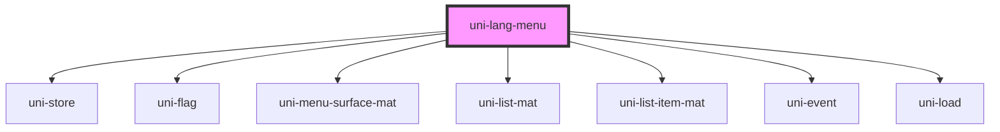

# uni-loc-menu

<!-- Auto Generated Below -->

## Properties

| Property         | Attribute         | Description | Type      | Default                 |
| ---------------- | ----------------- | ----------- | --------- | ----------------------- |
| `activeState`    | `active-state`    |             | `string`  | `'app.loc.menu.active'` |
| `init`           | `init`            |             | `string`  | `undefined`             |
| `languages`      | `languages`       |             | `string`  | `undefined`             |
| `menuState`      | `menu-state`      |             | `string`  | `'app.loc.menu.opened'` |
| `routing`        | `routing`         |             | `boolean` | `undefined`             |
| `translateState` | `translate-state` |             | `string`  | `'app.loc.translate'`   |
| `type`           | `type`            |             | `string`  | `undefined`             |

## Dependencies

### Depends on

- uni-store
- [uni-flag](../../../flag/components/@main)
- uni-menu-surface-mat
- uni-list-mat
- uni-list-item-mat
- uni-event
- uni-load

### Graph

----------------------------------------------

*Built with [StencilJS](https://stenciljs.com/)*
