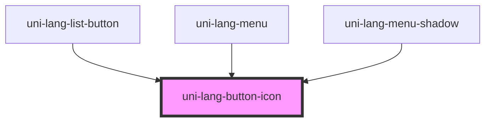

# uni-lang-button-icon

<!-- Auto Generated Below -->

## Properties

| Property | Attribute | Description | Type      | Default     |
| -------- | --------- | ----------- | --------- | ----------- |
| `name`   | `name`    |             | `string`  | `undefined` |
| `round`  | `round`   |             | `boolean` | `false`     |

## Dependencies

### Used by

 - [uni-lang-list-button](../../lang-list-button/@element)
 - [uni-lang-menu](../../../@element)
 - [uni-lang-menu-shadow](../../../@shadow)

### Graph

----------------------------------------------

*Powered by [UiWebKit](https://uiwebkit.com/)*
