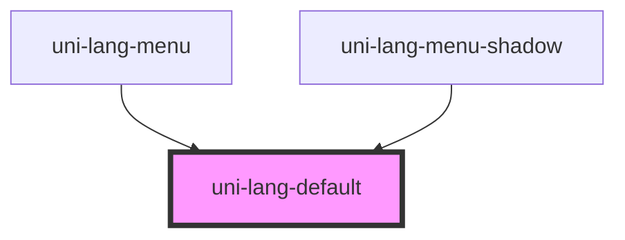

# uni-lang-default

<!-- Auto Generated Below -->

## Properties

| Property        | Attribute        | Description | Type                               | Default        |
| --------------- | ---------------- | ----------- | ---------------------------------- | -------------- |
| `activePath`    | `active-path`    |             | `string`                           | `'loc.active'` |
| `feature`       | `feature`        |             | `string`                           | `'uni.store'`  |
| `frame`         | `frame`          |             | `boolean`                          | `false`        |
| `isShadow`      | `is-shadow`      |             | `boolean`                          | `false`        |
| `selectedIndex` | `selected-index` |             | `number`                           | `0`            |
| `shadow`        | `shadow`         |             | `boolean`                          | `false`        |
| `top`           | `top`            |             | `boolean`                          | `false`        |
| `type`          | `type`           |             | `"local" \| "memory" \| "session"` | `'memory'`     |
| `value`         | --               |             | `UniLangItem[]`                    | `[]`           |

## Dependencies

### Used by

 - [uni-lang-menu](../../../@element)
 - [uni-lang-menu-shadow](../../../@shadow)

### Graph

----------------------------------------------

*Powered by [UiWebKit](https://uiwebkit.com/)*
