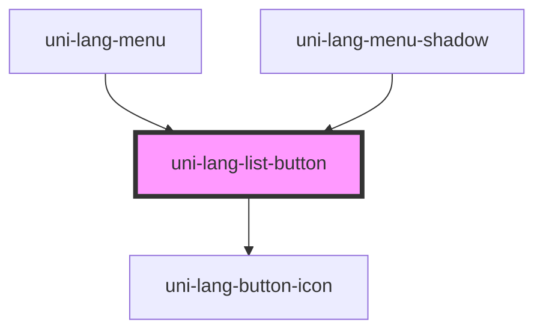

# uni-lang-list-button

<!-- Auto Generated Below -->

## Properties

| Property   | Attribute  | Description | Type                               | Default     |
| ---------- | ---------- | ----------- | ---------------------------------- | ----------- |
| `activate` | `activate` |             | `boolean`                          | `false`     |
| `flag`     | `flag`     |             | `string`                           | `undefined` |
| `mini`     | `mini`     |             | `boolean`                          | `false`     |
| `mode`     | `mode`     |             | `"flat" \| "outlined" \| "raised"` | `undefined` |
| `name`     | `name`     |             | `string`                           | `undefined` |
| `round`    | `round`    |             | `boolean`                          | `false`     |

## Dependencies

### Used by

 - [uni-lang-menu](../../../@element)
 - [uni-lang-menu-shadow](../../../@shadow)

### Depends on

- [uni-lang-button-icon](../../lang-button-icon/@element)

### Graph

----------------------------------------------

*Powered by [UiWebKit](https://uiwebkit.com/)*
