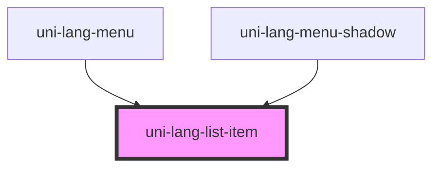

# uni-lang-menu-list-item

<!-- Auto Generated Below -->

## Properties

| Property   | Attribute  | Description | Type      | Default     |
| ---------- | ---------- | ----------- | --------- | ----------- |
| `activate` | `activate` |             | `boolean` | `false`     |
| `flag`     | `flag`     |             | `string`  | `undefined` |
| `name`     | `name`     |             | `string`  | `undefined` |
| `round`    | `round`    |             | `boolean` | `false`     |

## Dependencies

### Used by

 - [uni-lang-menu](../../../@element)
 - [uni-lang-menu-shadow](../../../@shadow)

### Graph

----------------------------------------------

*Powered by [UiWebKit](https://uiwebkit.com/)*
