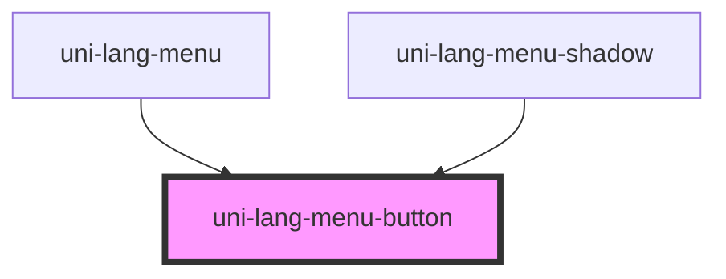

# uni-lang-menu-button

<!-- Auto Generated Below -->

## Properties

| Property     | Attribute     | Description | Type                               | Default        |
| ------------ | ------------- | ----------- | ---------------------------------- | -------------- |
| `activePath` | `active-path` |             | `string`                           | `'loc.active'` |
| `feature`    | `feature`     |             | `string`                           | `'uni.store'`  |
| `mini`       | `mini`        |             | `boolean`                          | `false`        |
| `mode`       | `mode`        |             | `"flat" \| "outlined" \| "raised"` | `undefined`    |
| `round`      | `round`       |             | `boolean`                          | `false`        |
| `separator`  | `separator`   |             | `string`                           | `'.'`          |
| `top`        | `top`         |             | `boolean`                          | `false`        |
| `type`       | `type`        |             | `"local" \| "memory" \| "session"` | `'memory'`     |

## Dependencies

### Used by

 - [uni-lang-menu](../../../@element)
 - [uni-lang-menu-shadow](../../../@shadow)

### Graph

----------------------------------------------

*Powered by [UiWebKit](https://uiwebkit.com/)*
