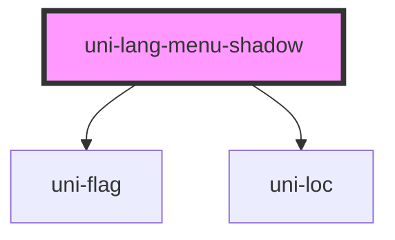

# uni-lang-menu-shadow

<!-- Auto Generated Below -->

## Properties

| Property         | Attribute         | Description | Type                               | Default                 |
| ---------------- | ----------------- | ----------- | ---------------------------------- | ----------------------- |
| `activeState`    | `active-state`    |             | `string`                           | `'app.loc.menu.active'` |
| `feature`        | `feature`         |             | `string`                           | `'uni.store'`           |
| `languages`      | `languages`       |             | `string`                           | `undefined`             |
| `mini`           | `mini`            |             | `boolean`                          | `undefined`             |
| `rounded`        | `rounded`         |             | `boolean`                          | `undefined`             |
| `route`          | `route`           |             | `string`                           | `'lang'`                |
| `routing`        | `routing`         |             | `boolean`                          | `undefined`             |
| `select`         | `select`          |             | `string`                           | `undefined`             |
| `separator`      | `separator`       |             | `string`                           | `'.'`                   |
| `translateState` | `translate-state` |             | `string`                           | `'app.loc.translate'`   |
| `type`           | `type`            |             | `"local" \| "memory" \| "session"` | `'session'`             |

## Dependencies

### Depends on

- [uni-flag](../../../flag/components/element)
- [uni-loc](../../../loc)

### Graph

----------------------------------------------

*Powered by [UiWebKit](https://uiwebkit.com/)*
