# uni-lang-menu-shadow

<!-- Auto Generated Below -->

## Properties

| Property         | Attribute         | Description | Type                               | Default                 |
| ---------------- | ----------------- | ----------- | ---------------------------------- | ----------------------- |
| `activeState`    | `active-state`    |             | `string`                           | `'app.loc.menu.active'` |
| `feature`        | `feature`         |             | `string`                           | `'uni.store'`           |
| `languages`      | `languages`       |             | `string`                           | `undefined`             |
| `mini`           | `mini`            |             | `boolean`                          | `false`                 |
| `rounded`        | `rounded`         |             | `boolean`                          | `false`                 |
| `route`          | `route`           |             | `string`                           | `'lang'`                |
| `routing`        | `routing`         |             | `boolean`                          | `false`                 |
| `select`         | `select`          |             | `string`                           | `undefined`             |
| `separator`      | `separator`       |             | `string`                           | `'.'`                   |
| `translateState` | `translate-state` |             | `string`                           | `'app.loc.translate'`   |
| `type`           | `type`            |             | `"local" \| "memory" \| "session"` | `'session'`             |

## Dependencies

### Depends on

- uni-store-set
- uni-button-mat
- uni-button-icon-mat
- uni-store-event-get
- [uni-flag](../../../flag/components/element)
- uni-button-label-mat
- uni-text
- uni-mat-f-arrow-drop-down
- uni-menu-surface-mat
- uni-list-mat
- uni-store-event-set
- uni-router-link
- uni-list-item-mat
- uni-route
- uni-router
- uni-event
- uni-store-load

### Graph

```mermaid
graph TD;
  uni-lang-menu-shadow --> uni-store-set
  uni-lang-menu-shadow --> uni-button-mat
  uni-lang-menu-shadow --> uni-button-icon-mat
  uni-lang-menu-shadow --> uni-store-event-get
  uni-lang-menu-shadow --> uni-flag
  uni-lang-menu-shadow --> uni-button-label-mat
  uni-lang-menu-shadow --> uni-text
  uni-lang-menu-shadow --> uni-mat-f-arrow-drop-down
  uni-lang-menu-shadow --> uni-menu-surface-mat
  uni-lang-menu-shadow --> uni-list-mat
  uni-lang-menu-shadow --> uni-store-event-set
  uni-lang-menu-shadow --> uni-router-link
  uni-lang-menu-shadow --> uni-list-item-mat
  uni-lang-menu-shadow --> uni-route
  uni-lang-menu-shadow --> uni-router
  uni-lang-menu-shadow --> uni-event
  uni-lang-menu-shadow --> uni-store-load
  uni-list-item-mat --> uni-list-item-ripple-mat
  style uni-lang-menu-shadow fill:#f9f,stroke:#333,stroke-width:4px
```

----------------------------------------------

*Powered by [UiWebKit](https://uiwebkit.com/)*
