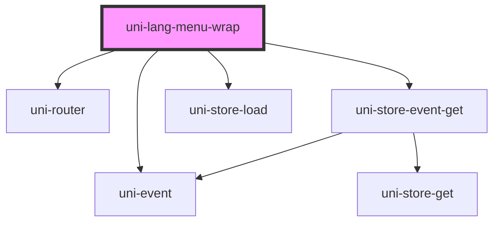

# uni-lang-menu-wrap

<!-- Auto Generated Below -->

## Properties

| Property        | Attribute        | Description | Type                               | Default               |
| --------------- | ---------------- | ----------- | ---------------------------------- | --------------------- |
| `activePath`    | `active-path`    |             | `string`                           | `'app.loc.active'`    |
| `feature`       | `feature`        |             | `string`                           | `'uni.store'`         |
| `routing`       | `routing`        |             | `boolean`                          | `false`               |
| `separator`     | `separator`      |             | `string`                           | `'.'`                 |
| `translatePath` | `translate-path` |             | `string`                           | `'app.loc.translate'` |
| `type`          | `type`           |             | `"local" \| "memory" \| "session"` | `'memory'`            |

## Dependencies

### Depends on

- uni-router
- uni-event
- uni-store-event-get
- uni-store-load

### Graph

----------------------------------------------

*Powered by [UiWebKit](https://uiwebkit.com/)*
