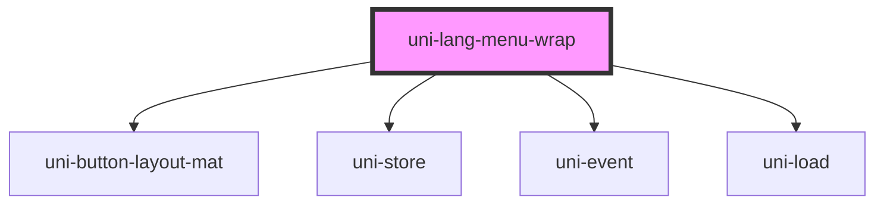

# uni-lang-menu-wrap

<!-- Auto Generated Below -->

## Properties

| Property         | Attribute         | Description | Type                               | Default                 |
| ---------------- | ----------------- | ----------- | ---------------------------------- | ----------------------- |
| `activeState`    | `active-state`    |             | `string`                           | `'app.loc.menu.active'` |
| `menuState`      | `menu-state`      |             | `string`                           | `'app.loc.menu.opened'` |
| `translateState` | `translate-state` |             | `string`                           | `'app.loc.translate'`   |
| `type`           | `type`            |             | `"local" \| "memory" \| "session"` | `'session'`             |

## Dependencies

### Depends on

- uni-button-layout-mat
- uni-store
- uni-event
- uni-load

### Graph

----------------------------------------------

*Built with [StencilJS](https://stenciljs.com/)*
