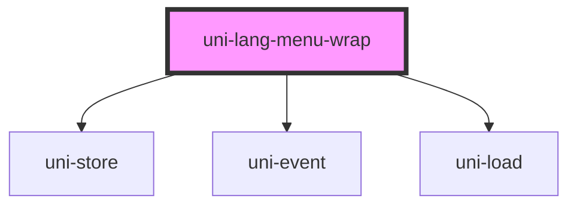

# uni-lang-menu-wrap

<!-- Auto Generated Below -->

## Properties

| Property         | Attribute         | Description | Type     | Default             |
| ---------------- | ----------------- | ----------- | -------- | ------------------- |
| `menuState`      | `menu-state`      |             | `string` | `'loc.menu.opened'` |
| `translateState` | `translate-state` |             | `string` | `'loc.translate'`   |
| `urlState`       | `url-state`       |             | `string` | `'loc.menu.url'`    |

## Dependencies

### Depends on

- uni-store
- uni-event
- uni-load

### Graph

----------------------------------------------

*Built with [StencilJS](https://stenciljs.com/)*
