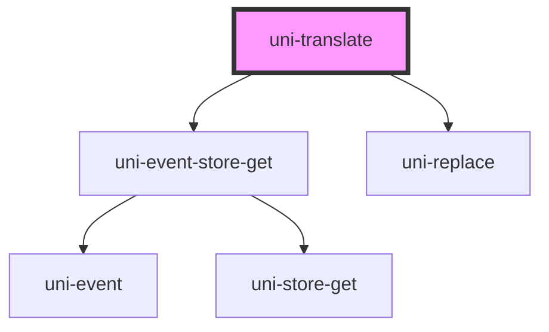

# uni-translate

<!-- Auto Generated Below -->

## Properties

| Property    | Attribute   | Description | Type                               | Default               |
| ----------- | ----------- | ----------- | ---------------------------------- | --------------------- |
| `activate`  | `activate`  |             | `boolean`                          | `false`               |
| `end`       | `end`       |             | `string`                           | `'}}'`                |
| `feature`   | `feature`   |             | `string`                           | `'uni.store'`         |
| `nested`    | `nested`    |             | `boolean`                          | `false`               |
| `path`      | `path`      |             | `string`                           | `'app.loc.translate'` |
| `separator` | `separator` |             | `string`                           | `'.'`                 |
| `start`     | `start`     |             | `string`                           | `'{{'`                |
| `type`      | `type`      |             | `"local" \| "memory" \| "session"` | `'memory'`            |

## Dependencies

### Depends on

- uni-event-store-get
- uni-replace

### Graph

----------------------------------------------

*Powered by [UiWebKit](https://uiwebkit.com/)*
