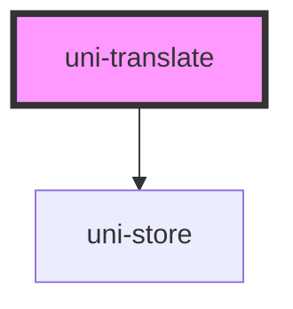

# uni-translate

<!-- Auto Generated Below -->

## Properties

| Property | Attribute | Description | Type     | Default           |
| -------- | --------- | ----------- | -------- | ----------------- |
| `end`    | `end`     |             | `string` | `' }}'`           |
| `start`  | `start`   |             | `string` | `'{{ '`           |
| `state`  | `state`   |             | `string` | `'loc.translate'` |
| `type`   | `type`    |             | `string` | `'session'`       |

## Dependencies

### Depends on

- uni-store

### Graph

----------------------------------------------

*Built with [StencilJS](https://stenciljs.com/)*
