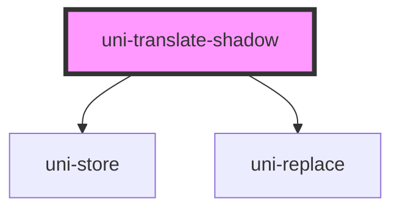

# uni-translate-shadow

<!-- Auto Generated Below -->

## Properties

| Property | Attribute | Description | Type                               | Default               |
| -------- | --------- | ----------- | ---------------------------------- | --------------------- |
| `end`    | `end`     |             | `string`                           | `' }}'`               |
| `start`  | `start`   |             | `string`                           | `'{{ '`               |
| `state`  | `state`   |             | `string`                           | `'app.loc.translate'` |
| `type`   | `type`    |             | `"local" \| "memory" \| "session"` | `'session'`           |

## Dependencies

### Depends on

- uni-store
- uni-replace

### Graph

----------------------------------------------

*Built with [StencilJS](https://stenciljs.com/)*
